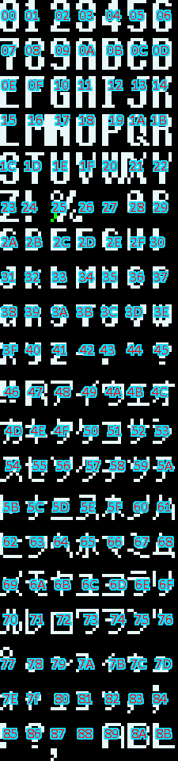

# Communication Messages Bitmap Font (SF/DATA/FONT/MOJI_\*.*)

There are two variants of the font: MOJI_0 and MOJI_D. In this fork, MOJI_0 is for Japanese and MOJI_D for non-Japanese builds. Upstream, MOJI_0 is for non-German and MOJI_D for German builds.

The .bmp files are regular Windows bitmap files. When editing, leave the color palette as is and ensure they are saved as 8bpp or 4bpp paletted and uncompressed. Characters are arranged in a grid of 20 rows and 7 columns, and each character tile is 8 pixels wide and 12 pixels tall, yielding a 56x240 image. Character tiles are numbered using the typical Western reading order, that is left to right, then top to bottom, and starting from 0. The few green pixels you see at the percent sign position is its continuation on the right when rendered. While in theory, other characters can be enlarged this way with foxfont, their rendering is unknown.

The .TRN files maps from character codes found in message files of the MSG directory to tile numbers, so the text you see and edit in source code becomes a sequence of tiles to display for the message routine. The .TRN is ordered by code point, starting with code point 0x20 (32 in decimal), corresponding to the space character in ASCII (and later supersets ISO-8859-1 and Unicode). However, the highest code point is 255, regardless of the language.

Messages files for European languages are strictly single octet (an 8-bit byte). For Japanese text, a simple variable byte scheme is used. Dakuten (looking like straight double quotes) and handakuten (looking like the degree sign) are used next to the appropriate katakana to graphically compose the phonogram (a character representing a syllable), when needed.

The build process will generate MOJI_0.FON from MOJI_0.bmp and use MOJI_0.TRN to read from the language-specific message file for outputting sequences of tile numbers embedded as constants. Those constants are later referenced, through a table, as an argument of a call to a text display routine. Depending on the language build configuration (and the fork), the MOJI_D files may be used instead.

# MOJI_0 Tile Table

