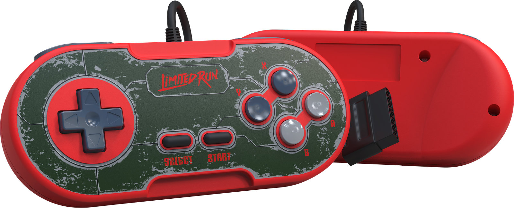

# Super NES Rumble Controller Support

<hr>

Document version 2.0, July 3 2024 &nbsp; &nbsp; &nbsp; &nbsp; &nbsp; &nbsp; &nbsp; &nbsp; &nbsp; &nbsp; Randal Linden

### 1. Super NES Controller Port Pinout

```
---------------------------------------------------------
|                                |                       \
|    (1)    (2)    (3)    (4)    |    (5)    (6)    (7)  |
|                                |                       /
---------------------------------------------------------

1   VDD

2   Clock

3   P/S Out 0

4   $4017 D0

5   $4017 D1

6   IO Bit

7   Ground
```

### 2. Rumble Data Configuration

```
<---------------- Rumble Sentry ---------------> <----------------- Rumble Data ---------------->
-------------------------------------------------------------------------------------------------
|     |     |     |     |     |     |     |     |     |     |     |     |     |     |     |     |
|  0  |  1  |  1  |  1  |  0  |  0  |  1  |  0  | R3  | R2  | R1  | R0  | L3  | L2  | L1  | L0  |
|     |     |     |     |     |     |     |     |     |     |     |     |     |     |     |     |
-------------------------------------------------------------------------------------------------
   1     2     3     4     5     6     7     8     9    10    11    12    13    14    15    16
```

### 3. Description of Data Formats

The Rumble Protocol uses two groups of data: 1) the "Rumble Sentry" Group and 2) the "Rumble Data" Group. Each group of data is eight bits wide.  

The first group, the "Rumble Sentry" is a predefined bit pattern that is used to identify that the "Rumble Data" group is valid.  

The second group, the "Rumble Data" is a sequence of 2 sets of 4 bits which indicate the intensity of rumble operations for the Right motor (low frequency) and Left motor (high frequency)  

Each group of 4 Rumble Data bits comprise an intensity value from 0 to 15. Intensity value 0 means NO rumble and intensity value 15 means maximum rumble.  

### 4. Theory of Operation

Every display field (1/60 second), the SNES hardware automatically reads the controller bits after Vertical Blank for approximately 215 microseconds.  

When the P/S Out line goes high and then low you should clear the 16-bit shift register.

After the automatic read of the controller bits has completed, the rumble protocol software will perform a sequence of 16 operations to transmit the rumble information. The 16 operations are comprised of 1 output bit followed by a clock transition to indicate that the hardware should read that bit.  

After each strobe of the Clock Line, the hardware should shift the data bit into a 16-bit shift register.  

After 16 strobes of the Clock Line, the upper 8 bits of the shift register contain the pattern ``01110010`` and the lower 8 bits of the shift register contain the rumble intensity values for the Right and Left motors.  

If the upper 8 bits do not match ``01110010`` then nothing is done. Otherwise, the rumble motors are activated according to the intensity specified by the Rumble Data values.
